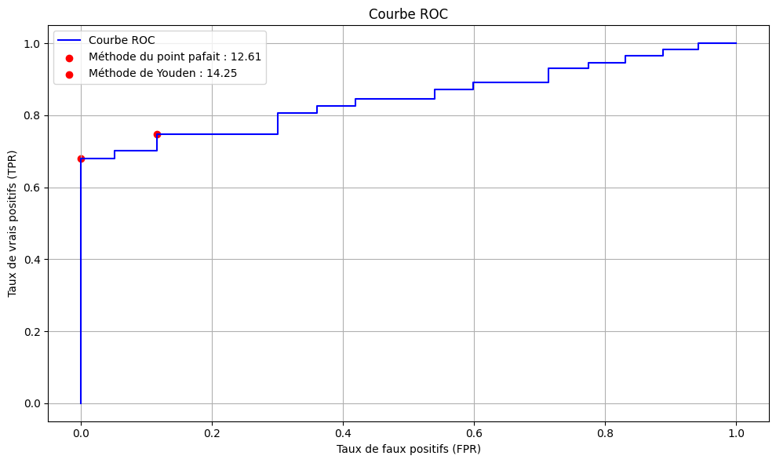
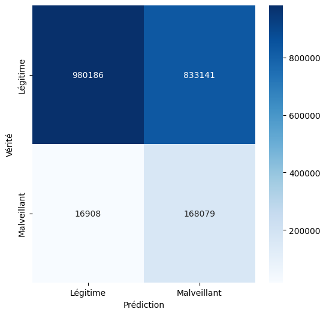

# Détection d'Intrusion Réseau (IDS) par Analyse Comportementale

Ce projet implémente un système de détection d'intrusion (NIDS) basé sur l'analyse statistique des flux réseaux (NetFlows) pour identifier le botnet **Neris**. Contrairement aux approches par signature, cet algorithme (**MINDS**) détecte les anomalies comportementales (volume, fréquence) sans connaître le modèle de l'attaque à l'avance.

## 📌 Contexte et Données
* **Dataset :** CTU-13 (Scénario 9).
* **Menace :** Botnet *Neris* (Infecte 10 machines, génère du Spam et du Port Scan).
* **Données d'entrée :** Fichiers `.binetflow` (Agrégation des paquets en flux unidirectionnels).

## 🛠️ Méthodologie Technique

L'approche repose sur la détection d'écarts statistiques par rapport à un trafic "sain" appris durant une phase d'entraînement (40 min).

### 1. Feature Engineering (Les 4 Dimensions)
Pour chaque flux, nous calculons 4 métriques contextuelles sur une fenêtre glissante de 5 minutes :
* **Fan-out (src_count) :** Nombre de destinations contactées par une source (Détecte les Scans/Spams).
* **Fan-in (dst_count) :** Nombre de sources contactant une destination (Détecte les DDoS).
* **Complexité (src_dst_port / src_port_dst) :** Analyse des ratios Ports/IP.

*Note : Une transformation logarithmique (`np.log1p`) est appliquée pour gérer les échelles exponentielles du trafic réseau.*

### 2. Algorithme de Détection
Nous calculons un **Score d'Anomalie** global basé sur la distance euclidienne pondérée (Z-Score) par rapport à la moyenne et l'écart-type du trafic normal.
> Si le score dépasse le seuil optimal, le flux est marqué comme attaque.

## 📊 Résultats et Évaluation

### Seuillage (Courbe ROC)
Le seuil d'alerte optimal a été fixé à **14.25** en utilisant l'**Indice de Youden**, offrant le meilleur compromis mathématique entre détection et fausses alertes.

### Performance (Matrice de Confusion)
* **Rappel (Recall) : 91%** - Le système est très sensible et détecte la quasi-totalité des activités du botnet.
* **Précision : 17%** - Le taux de faux positifs est élevé.

## 🔎 Analyse Critique (Forensics)
Pourquoi la précision est-elle basse ?
L'analyse des Faux Positifs révèle que l'algorithme a classé le trafic du serveur **DNS (147.32.84.138)** comme malveillant.
* **Raison :** Ce serveur légitime génère un volume énorme de requêtes UDP (Port 53), ce qui entraîne une explosion des compteurs (Fan-out/Fan-in) similaire au comportement du botnet.
* **Amélioration proposée :** Implémentation d'une **Liste Blanche (Whitelisting)** pour exclure les serveurs d'infrastructure connus (DNS, Proxy) du calcul d'anomalie.

## 💻 Installation / Utilisation
Le projet est présenté sous forme de Jupyter Notebook.
1.  Télécharger le dataset [CTU-13 Scénario 9](https://www.stratosphereips.org/datasets-ctu13).
2.  Lancer `IDS_Detection_Botnet.ipynb` via Jupyter ou Google Colab.
